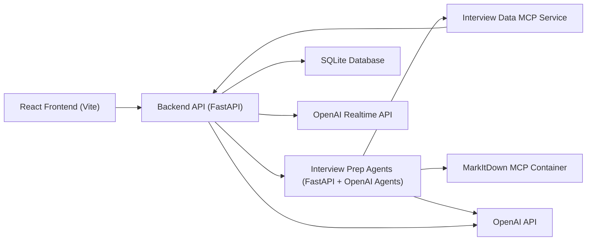

# InterviewSimulator

Interview Simulator App is an AI-powered practice platform for job candidates who want to rehearse interviews against a specific CV and job description. The application lets a user create an account, upload or paste their documents, run a guided mock interview, and receive a scored feedback report with strengths, weaknesses, and per-question coaching.

The project is orchestrated with .NET Aspire and is composed of a React frontend plus several FastAPI services. The recommended way to run everything locally is through the root `apphost.cs` file, which wires the services together automatically.


## What it does

- Creates and manages user accounts with login, logout, and session persistence.
- Accepts CV and job description content either as pasted text or uploaded files.
- Parses uploaded `.pdf`, `.doc`, `.docx`, `.txt`, `.md` and `.html` files into plain text.
- Runs a question-by-question mock interview flow.
- Runs a live coding round with a company-style problem, code editor, and AI interviewer.
- Supports realtime voice conversation during the coding round through OpenAI Realtime.
- Offers on-demand hints and model answers during an interview.
- Generates a final interview report with an overall score, strengths, improvement areas, behavioral feedback, technical feedback, communication feedback, per-question feedback, and coding-round evaluation.
- Stores interview history so users can revisit past sessions and track improvement.

## Architecture



## Main Services

### Frontend

Located in `src/frontend`.

- React 19 + TypeScript + Vite
- Handles authentication, interview setup, interview execution, live coding, history, and summary pages
- Proxies `/api` requests to the backend during development

### Backend API

Located in `src/backend`.

- FastAPI service that acts as the main application backend
- Owns authentication, interview persistence, document parsing requests, interview session lifecycle, coding-round state, realtime voice session setup, and final scoring/report orchestration
- Uses SQLite for local persistence
- Calls the agent service for AI-generated plans, hints, model answers, coding replies, coding evaluation, and reports

### Interview Prep Agents

Located in `src/interview-prep-agents`.

- FastAPI service built around the OpenAI Agents SDK
- Generates interview questions, reports, hints, model answers, coding interviewer replies, and coding evaluations
- Integrates with MCP-related services provisioned by the Aspire workflow

### Interview Data MCP

Located in `src/interview-data-mcp`.

- FastAPI + MCP server
- Exposes interview session data from the SQLite database as MCP tools for the agent workflow

### MarkItDown MCP Container

Provisioned by the Aspire app host from a docker image based on [this repository](https://github.com/microsoft/markitdown/tree/main/packages/markitdown-mcp).

- The application parses uploaded interview documents in the backend using the Python `markitdown` package

## How the AI works

The app uses the OpenAI Agents SDK to run a pipeline of specialized AI agents. Each agent has a specific job and hands off to the next one when its phase is complete.

### Question generation

When you start a session, a **Planner agent** reads your resume and the job description and writes a custom set of interview questions for you — behavioral ones based on your background and technical ones based on the role. If the AI call fails, the app falls back to a built-in template system so the session always starts.

### The free-form coach chat

The app also includes a chat interface where you can have an open-ended coaching conversation. That interface runs a multi-agent system with four agents that work in sequence:

**Orchestrator** — the entry point for every message. It checks what phase the interview is in, reads the stored session, and routes the conversation to the right specialist. It also handles document intake: if you share a link to your resume, the orchestrator calls a document-parsing tool to convert it to text and saves it to the session before passing control on.

**Behavioral interviewer** — takes over once intake is complete. It asks four STAR-method questions tailored to your background, one at a time. When it has asked and received answers for all four, it hands off to the technical interviewer.

**Technical interviewer** — asks four role-specific technical questions based on the stored resume and job description, one at a time. When all four are answered it hands off to the summarizer. If the conversation goes off-track it passes control back to the orchestrator.

**Summarizer** — reads the full session transcript and generates a final assessment covering strengths, weaknesses, behavioral performance, technical performance, and three to five concrete improvement suggestions.

### Scoring and feedback

After you finish a structured session the **Evaluator agent** reads every question and answer, gives each answer a score and a short piece of feedback, and returns an overall score from 1 to 100. If that call fails the app uses a local heuristic scorer that looks at things like answer length, use of action verbs, STAR structure keywords for behavioral answers, and technical signal words for technical answers.

If you request a hint or a model answer, a dedicated **Helper agent** generates a short response — either a nudge pointing you in the right direction without giving the answer away, or a polished sample answer you can study.

## Setup

### Prerequisites

- A recent .NET SDK with support for file-based apps and .NET Aspire
- Node.js and npm
- Python 3.13
- [`uv`](https://docs.astral.sh/uv/)
- Docker Desktop or another local container runtime
- An OpenAI API key

### Configuration

The root `apphost.cs` reads settings from `apphost.settings.json` and user secrets.

The important OpenAI settings are:

- `OpenAI:ApiKey`
- `OpenAI:Model`
- `OpenAI:BaseUrl`

The checked-in `apphost.settings.json` contains placeholders:

```json
"OpenAI": {
  "ApiKey": "{{OPENAI_API_KEY}}",
  "Model": "gpt-4.1-mini",
  "BaseUrl": "https://api.openai.com/v1"
}
```

Optional realtime voice settings used by the backend:

- `OPENAI_REALTIME_MODEL` (defaults to `gpt-realtime`)
- `OPENAI_REALTIME_TRANSCRIPTION_MODEL` (defaults to `gpt-realtime-whisper`)
- `OPENAI_REALTIME_VOICE` (defaults to `marin`)

### Recommended local setup

Use .NET user secrets so the API key is not committed to the repo:

```
dotnet user-secrets --file ./apphost.cs set "OpenAI:ApiKey" "<your-openai-api-key>"
```

## How to Run the Application

### Recommended: run the full stack with Aspire

From the repository root:

```
aspire run
```

This starts the Aspire app host.

When startup completes, open the frontend URL shown by the app host in the terminal or browser. In the current Aspire setup, the frontend is exposed on port `5173`, typically at `http://localhost:5173`.

